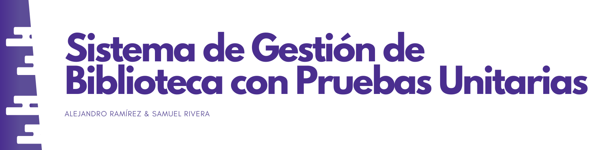

<h1 align="center">RETO 03 - Sistema de Gestión de Biblioteca con Pruebas Unitarias en Java</h1>

</img>

<details>
  <summary>Tabla de Contenidos:</summary>
  <ol>
    <li><a href="#about">Sobre el proyecto</a></li>
    <li><a href="#objectives">Objetivos</a></li>
    <li><a href="#sistemflow">Flujo del Sistema</a></li>
    <li><a href="#usage">Uso</a></li>
    <li><a href="#gallery">Galeria</a></li>
    <li><a href="#code">Código</a></li>
    <li><a href="#contact">Contacto</a></li>
  </ol>
</details>

<!-- Sobre -->
<h2 id="about">Sobre el proyecto 📚</h2>
<h3>Introducción:</h3>
<p>En el desarrollo de software, la implementación de pruebas unitarias es fundamental para garantizar la calidad y fiabilidad del código. En este proyecto se creara un sistema de gestión de bibloteca en Java, aplicando pruebas unitarias con JUnit 5 y Mockito.</p>

<p>Puedes encontrar el <a href="#">video aquí 🎥.</a></p>
<p>Puedes encontrar el repositorio guía <a href="https://github.com/cesar-devsenior/library-management"> aquí 📄.</a></p>


<h3 align="left">Lenguajes y herramientas:</h3>

<p align="left">
  <a href="https://skillicons.dev">
    
  </a>
</p>

<!-- Objetivos -->
<h2 id="objectives">Funciones Principales 🎯</h2>

<p>Desarrollar una aplicación de escritorio que permita:</p>

<h3>Objetivos:</h3>

<ol>
    <li><strong>Sistema:</strong></li>
    <p>Implementar un sistema de gestión de biblioteca en Java que permita la administración de libros, usuarios y préstamos.</p>
    <li><strong>Uso de JUnit 5:</strong></li>
    <p>Desarrollar pruebas unitarias con JUnit 5 para validar la funcionalidad de la capa de servicio.</p>
    <li><strong>Uso de Mockito</strong></li>
    <p>Utilizar Mockito para simular el comportamiento de los repositorios y asegurar pruebas unitarias efectivas.</p>
    <li><strong>Manejo de excepciones.</strong></li>
    <p>Implementar el manejo de excepciones en Java para capturar y gestionar errores de manera eficiente.</p>
</ol>

<h3>Beneficios del Marco de Pruebas Unitarias en Java:</h3>

<ol>
    <li><strong>Mejora la calidad del código:</strong></li>
    <p>Permite detectar errores antes de la implementación en producción.</p>
    <li><strong>Facilita el mantenimiento:</strong></li>
    <p>Un código con pruebas bien diseñadas es más facil de modificar y escalar.</p>
    <li><strong>Promueve el desarrollo basado en pruebas (TDD):</strong></li>
    <p>Ayuda a diseñar software de manera más estructurada y modular.</p>
    <li><strong>Reduce el tiempo de depuración:</strong></li>
    <p>La detección temprana de errores evita la acumulación de fallos.</p>
</ol>

<h2 id="sistemflow">Desacripción de Flujo del Sistema 💻</h3>

<p>La aplicación de gestión de biblioteca permite a los usuarios registrarse, buscar libros en un catálogo organizado, y solicitar préstamos, mientras el sistema verifica la disponibilidad y registra las fechas de devolución. Los administradores pueden gestionar inventarios, añadir nuevos libros, y monitorear préstamos y devoluciones. Además, se aplican penalizaciones automáticas por retrasos y se generan estadísticas para optimizar el uso de recursos. Todo esto crea un flujo eficiente para conectar usuarios con los libros de manera organizada y automatizada.</p>

<ol>
    <li><strong>Agregar un Libro:</strong> El usuario introduce los datos de un nuevo libro en la biblioteca.</li>
    <li><strong>Consultar un Libro:</strong> Se obtiene información detallada de un libro a partir de su ID.</li>
    <li><strong>Registrar un Usuario:</strong> Un usuario solicita un libro, registrándose la fecha de préstamo.</li>
    <li><strong>Consultar Préstamos por Usuario:</strong> Se obtiene el historial de préstamos realizados por un usuario.</li>
</ol>

<h3>Requerimientos Funcionales:</h3>

<ol>
<li><strong>Gestión de Libros:</strong></li>
    <ul>
        <li>Agregar un libro con ID, título y autor.</li>
        <li>Obtener un libro mediante su ID.</li>
    </ul>
<li><strong>Gestión de Usuarios:</strong></li>
<ul>
    <li>Crear un usuario con ID y nombre.</li>
</ul>
<li><strong>Gestión de Préstamos:</strong></li>
<ul>
    <li>Prestar un libro a un usuario registrando la fecha del préstamo.</li>
    <li>Obtener todos los préstamos de un usuario específico.</li>
</ul>
</ol>

<h3>Requerimientos de Pruebas Unitarias:</h3>

<ol>
<li><strong>Pruebas de LibraryService</strong></li>
    <ul>
        <li>Validar la adición de un libro.</li>
        <li>Validar la recuperación de un libro por ID.</li>
        <li>Validar la creación de un usuario.</li>
        <li>Validar el préstamo de un libro a un usuario.</li>
        <li>Validar la consulta de préstamos por usuario</li>
    </ul>
<li><strong>Uso de Mockito</strong></li>
<ul>
    <li>Simular la interacción con BookRepository y LoanRepository.</li>
    
</ul>
</ol>

<h3>Manejo de Excepciones y Errores en Java</h3>

<p>Para grarantiar la estabilidad del sistema, se implementará el manejo de excepciones con try y catch. Algunos casos de uso incluyen:</p>
<ul>
    <li><strong>Libro no encontrado:</strong> Lanzar una NoSuchElementException si el libro solicitado no existe en la base de datos.</li>
    <li><strong>Usuario no encontrado:</strong> Lanzar una IllegalArgumentException si se intenta prestar un libro a un usuario inexistente.</li>
    <li><strong>Libro ya prestado:</strong> Capturar un posible error si un libro ya ha sido prestado y evitar que se preste nuevamente sin ser devuelto.</li>
    <li><strong>Errores generales de base de datos</strong> Uso de SQLException para manejar errores de conexión o consulta a la base de datos.</li>
</ul>

<!-- USO -->
<h2 id="usage">Uso 🚀</h2>
<h3>Ejecutar el programa</h3>
<p text-align="justify">Para ejecutar este programa es necesario tener el JDK 21 de Java. Este se puede descargar desde el sitio de <a href="https://www.oracle.com/java/technologies/downloads/">Oracle</a></p>

<p>Instrucciones para configurar el proyecto localmente:</p>

<h3>Prerequisitos:</h3>
<ul>
  <li>IDE (IntelliJ, Eclipse, NetBeans, VSCode, etc).</li>
  <li>JDK > 21 <a href="https://www.oracle.com/java/technologies/downloads/">Download JDK</a></li>
</ul>

<h3>Instalación:</h3>

<p>
  <strong>Nota:</strong> Este es un proyecto de uso estudiantil, no debe utilizarse para uso comercial.
</p>

```shell
# Clona el repositorio
git clone https://github.com/dnbsammie/Reto03.git
cd Reto03-clone

# Ejecuta el projecto
javac Main.java

java Main
```

<!-- GALERIA -->
<h2 id="gallery">Galería 🖼</h2>
<p align="center">
  
  
  
</p>
<p align="center">
  <strong>Fig. 1:</strong> Imágenes de ejemplo del proyecto.
</p>

<!-- CÓDIGO -->
<h2 id="gallery">Código 👨‍💻</h2>
<h3>Book: </h3>

```java

public class Book {
    private final String id, title, author;
    private boolean isBorrowed;

    public Book(String id, String title, String author, boolean isBorrowed) {
        this.id = id;
        this.title = title;
        this.author = author;
        isBorrowed = false;
    }

    public String getId() {return id;}
    public String getTitle() {return title;}
    public String getAuthor() {return author;}

    public boolean isBorrowed() {
        return isBorrowed;
    }

    public void setBorrowed(boolean isBorrowed) {
        this.isBorrowed = isBorrowed;
    }
}

```

<!-- CONTACTO -->
<h2 id="contact">Contacto 📧</h2>
<p>
  <strong>Integrante 1:</strong> Alejandro Ramirez<br>
  <strong>GitHub:</strong> <a href="https://github.com/Alejo12680">https://github.com/Alejo12680</a><br>
  <strong>Integrante 2:</strong> Samuel Rivera<br>
  <strong>GitHub:</strong> <a href="https://github.com/dnbsammie">https://github.com/dnbsammie</a>
</p>
